## What is this
This is a simple banking application demonstrating some capabilities of Spring Boot as a Back-End service framework and Android as a Front-End application
Back-End capabilities include:
* Microservices architecture
* Security measures
  * Self-signed HTTPS connection and preventing man-in-the-middle attacks
  * Authentication using session validation
  * Preventing users to choose poor passwords and keeping SHA-256 hashcode of passwords in database
  * Not keeping banking card passwords in database
* Database migration and schema change management using Liquibase
* Using kafka to distribute load over time and make it possible to distribute load over several workers
* Using JPA and Hibernate for data model management (Which this technology provides great functionalities like associations, bindings, entity graphs, lockings, transactions)
* Using JUnit to test services in uppermost levels to check the functionalities and services

Also Front-End capabilities include:
* Security measures
  * Self-signed HTTPS connection and preventing man-in-the-middle attacks
  * Root detection and preventing application to run on rooted devices
  * Obfuscating all classes to make reverse-engineering hard enough
  * Seperating core functionalities as SDK and making opportunity to write SDK in native C++ code to make it harder to reverse-engineer
* Activities
* Dialogs
* Toasts

## How to use
0. Prerequisite) You must have postgresql database running with an empty database named "wallet", and kafka service running with 2 topics named "performing" and "verifying"
1. Backend) Build backend application with "mvn package". Then run service with "java -jar target/wallet-0.0.1-SNAPSHOT.jar"
2. Frontend) Set ip-address of your running service in variable named "prefix" in the class "com.example.wallet.sdk.MobileSdk". Build apk of frontend application with android studio and gradle. Then move the apk file to your phone and install it
3. Sign-in with username=admin and password=admin or sign-up with a new user
4. Start banking, you can do the following:
	* Add/delete/edit cards
	* Make transactions, send money from your cards to any target cards you want

## About
Masoud Taghavian (masoud.taghavian@gmail.com)  
Enjoy!

## Screenshots
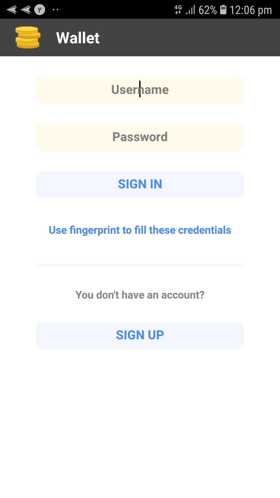
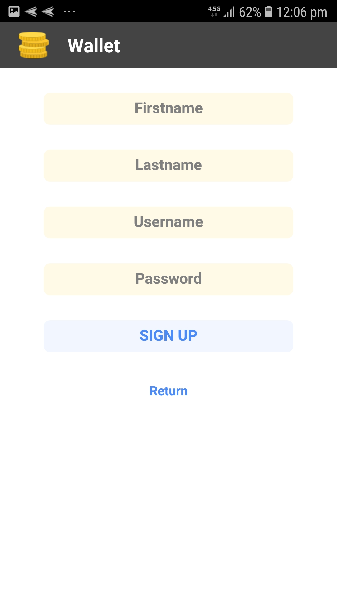
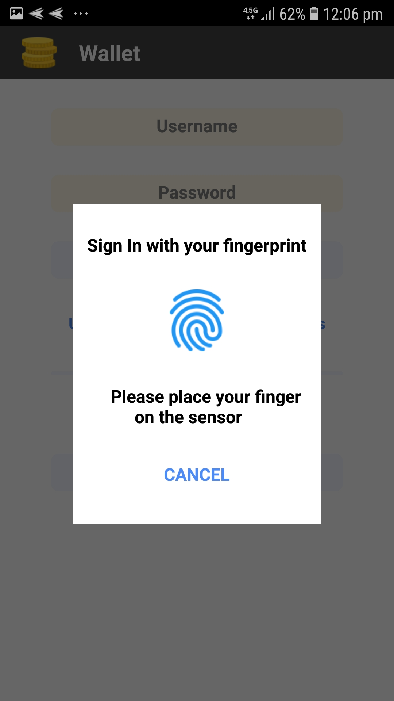
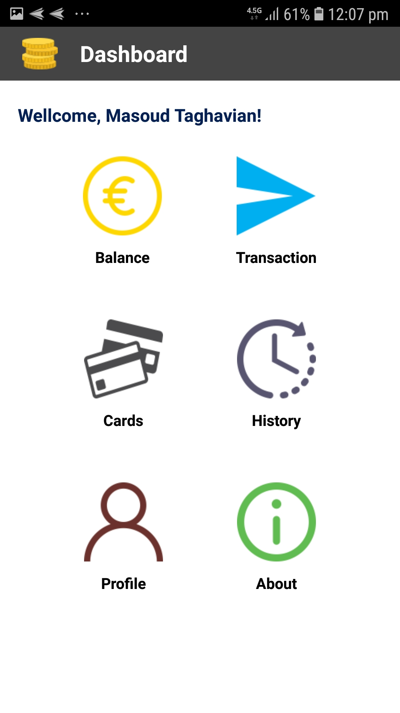
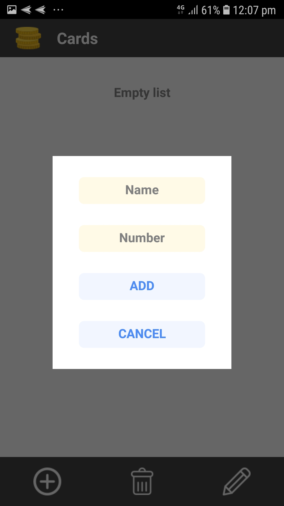
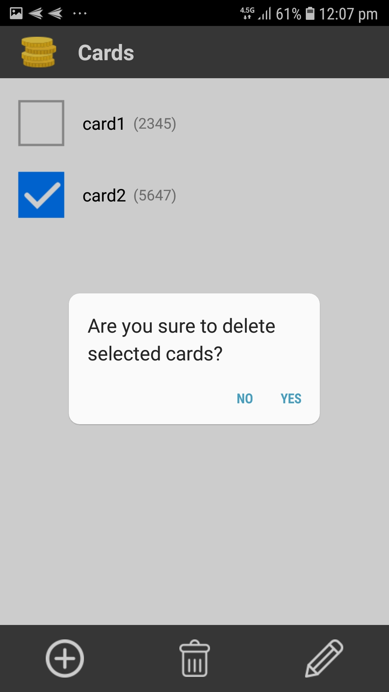
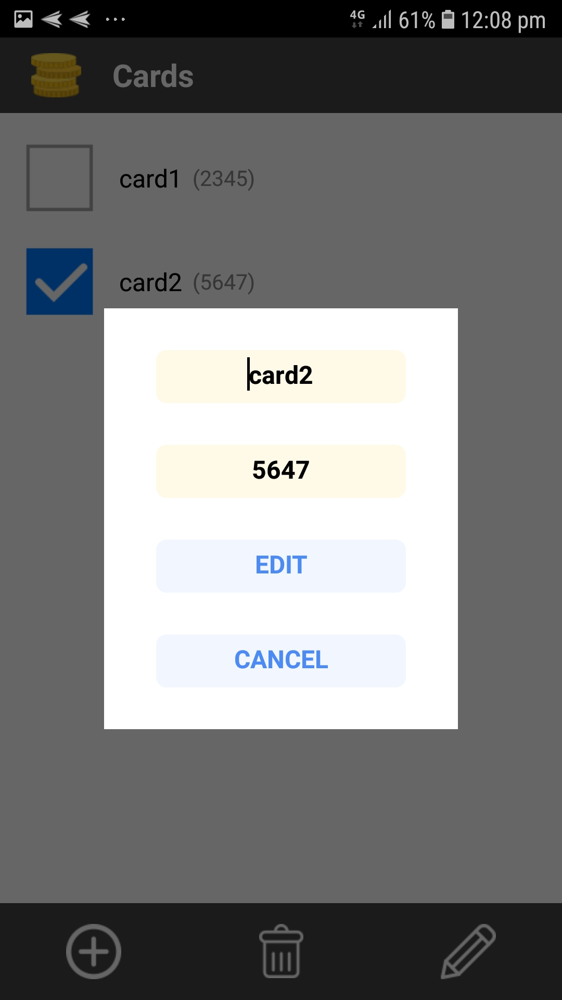

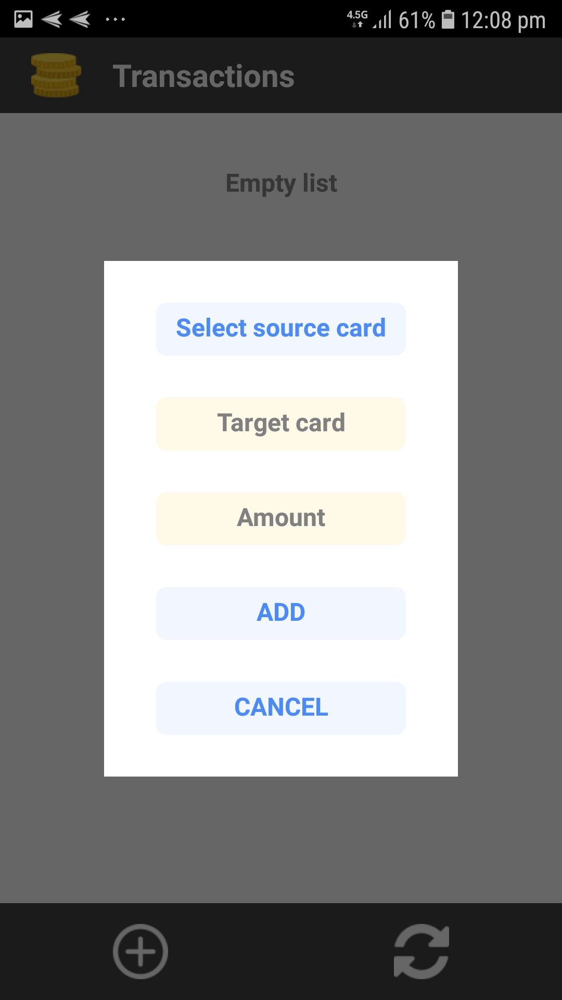
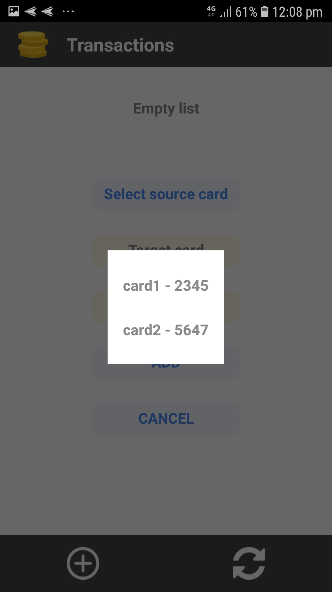
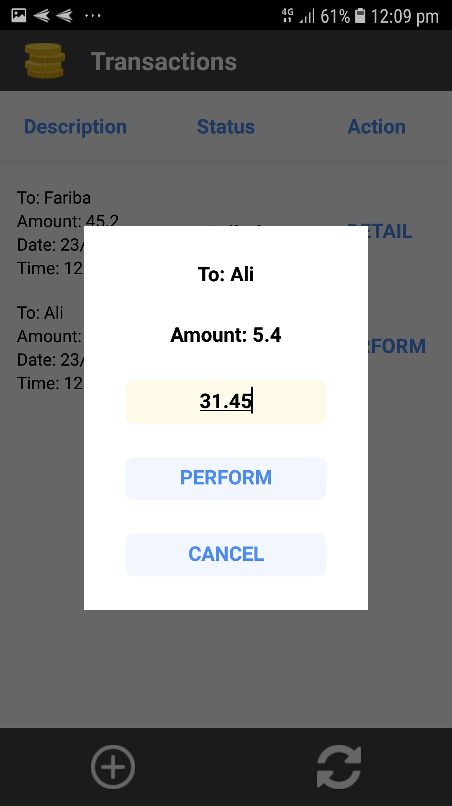
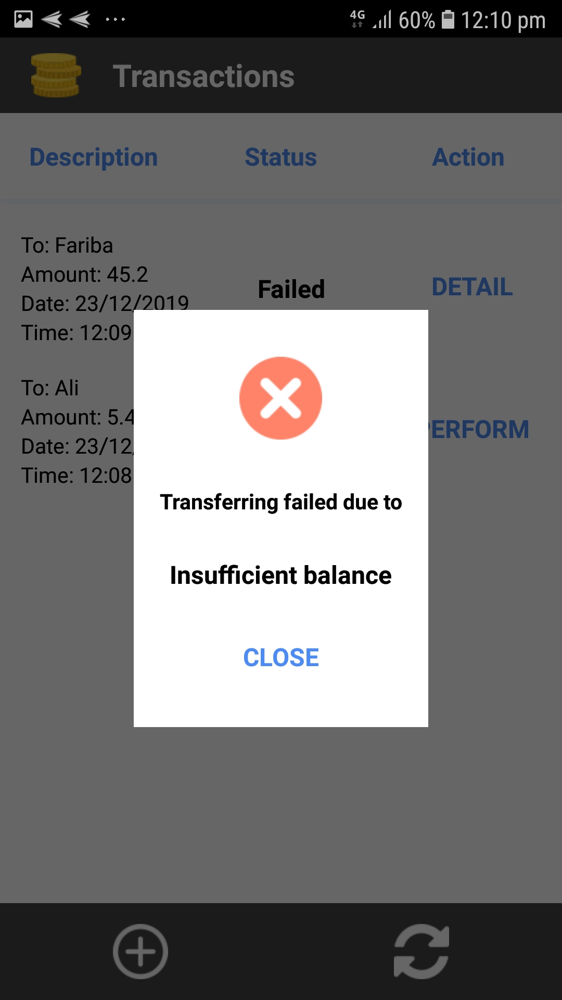
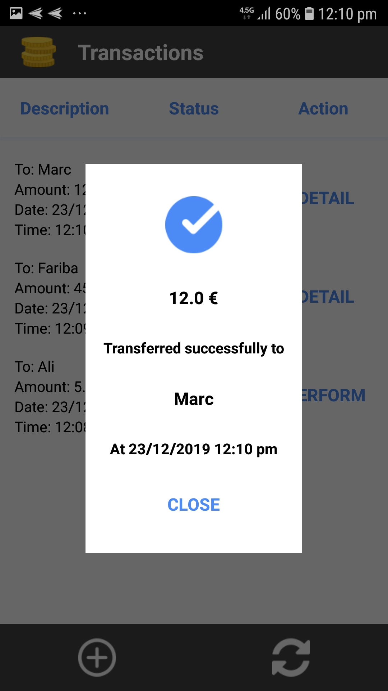
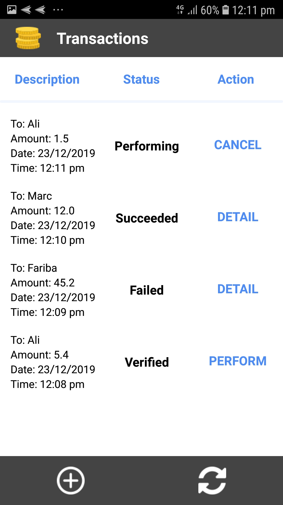

